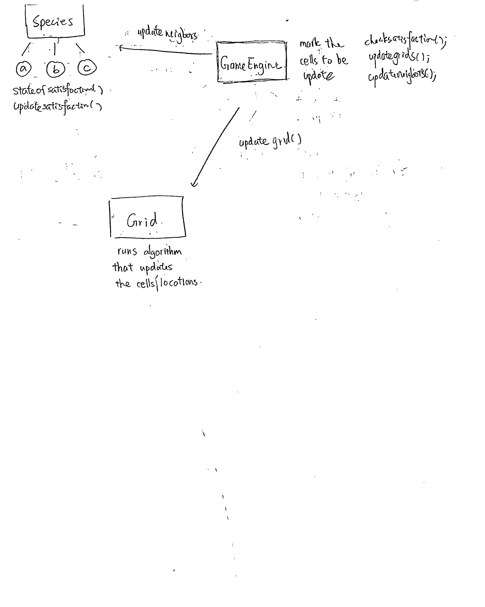
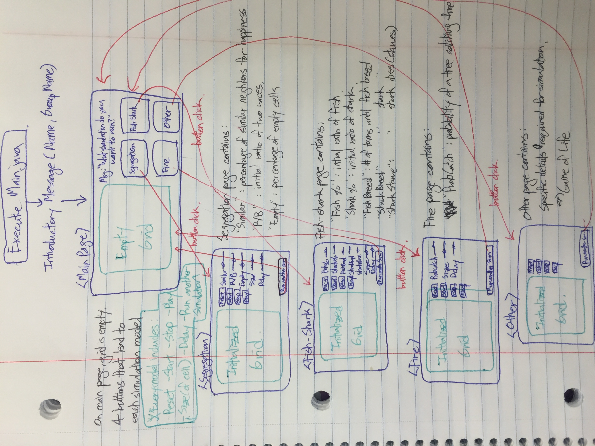

# Design for Cell Society

### Introduction

+ The objective of this project is to come up with a fluid, flexible platform on which various Cellular Automata programs - including, but not limited to Model of Segregation, Predator-Prey Relationships, and Spreading of Fire - can be run on.

+ Abstraction is the key to our project, in that the platform must be able to account for different types of CA models. As such, we have come up with three key components to the project, which are as follows:
	* **Grid Template**: This is the basic template on which the *Game Engine* and each *Species* will operate.
	* **Game Engine** : This is the *Game Loop* of our project that will not only give the start/stop signs for each step of the game, but also store the *status quo* of each state so that individual species know whether to change their state or not once the Game Loop begins.
	* **Species** : This is the abstract model on which individual species will be based. Each individual species (ex: Sharks, Fire, different races) will work on the module provided by the Species superclass and manipulate the module so that specific details inherent to each model can be provided. The species class will be open to extension but closed to algorithms.

	

### Overview

+ **Grid Template**
	* The **"map"** on which each individual cell operates
	* Could be implemented with a 2D array ***or*** a map, should be prone to switching between one or the other
	* Runs algorithm that update the cells locations
	* Should be open to changes of the shape of the grid but the interfaces should be closed

+ **Game Engine**
	* Gets satisfaction from species and marks cells to be updated
	* Updates grids and species
	* Interfaces should be closed to changes in algorithm and should be open extensions for other new features
	
+ **Game Loop** 
	* Runs the *Game Loop* including the start/stop command for each step of the process
	* Initializes *Game Engine*

+ **Species**
	* Subclasses that represent different states of the cell, as well as the algorithms that are in charge of how each cell responds given its current state & surroundings
	* Interacts with neighbors based on its status at the given point in time
	* Different kinds of species will extend from the Species superclass and could have different characteristics. In other words, the structure will be open to extension. On the other hand, it will be closed to changes in algorithms. For example, different ways of defining satisfaction of a species should not lead to code changes in other classes. The other classes should follow the same open closed principle. 
### Design Overview Diagram

	

	

### User Interface

+ When Main.java is executed, a short splash message displaying our team name and individual members' names will be shown. After the message disappears, the Main Page will feature an empty grid on the left-hand side, as well as four buttons on the right-hand side that each lead to different simulations: Segregation, Fish-Shark, Fire, and Other.
	* The grid will always be in the same location, regardless of what page the user is on.
	* Please refer to the picture at the end of this section for visual reference.

+ Each simulation model page will contain the following features in common:
	* Reset (button): The grid will be initialized to its starting state.
	* Start (button): The game engine will run the game loop indefinitely, until the end conditions are reached or until the stop button is clicked.
	* Stop (button): The game engine will halt the game loop.
	* Play (button): The game engine will run a single iteration of the game loop.
	
	* Size of Cell (text box): The user will input an integer that determines the size of each cell on the grid.
	* Delay (text box): The user will input an integer that determines the delay between each iteration of the game loop.
	
	* Run Another Simulation (button): The user will be moved back to the **Main Page**, the initial page that contains the empty grid and the four buttons that each lead to different simulations.

### Design Details

### Design Considerations

### Team Responsibilities

+ One person in charge of Species - Owen
+ One person in charge of Game Engine - Chalena
+ One person in charge of grid/miscellaneous components - Ray

