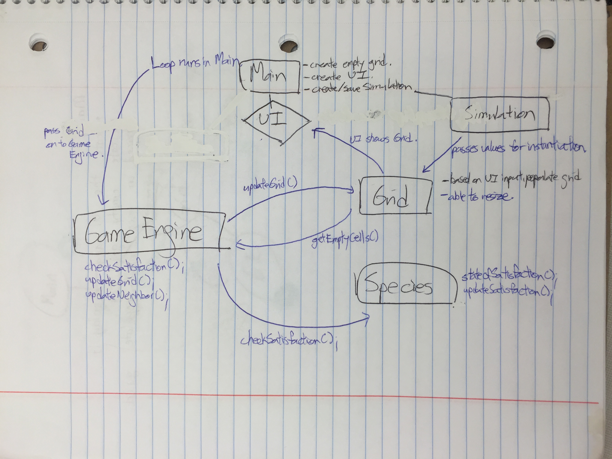

# Design for Cell Society

### Introduction

+ The objective of this project is to come up with a fluid, flexible platform on which various Cellular Automata programs - including, but not limited to Model of Segregation, Predator-Prey Relationships, Spreading of Fire, and Game of Life - can be run on.

+ Abstraction is the key to our project, in that the platform must be able to account for different types of CA models. Because of this we have come up with a solid base to our project and allowed the most flexibility to be in adding a simulation or changing the values/algorithms of a simulation. As such, we have come up with three key components to the project, which are as follows:
	* **Grid Template**: This is the basic template on which the *Game Engine* and each *Species* will operate.
	* **Game Engine** : This is part of the *Game Loop* of our project that will not only give the start/stop signs for each step of the game, but also store the *status quo* of each state so that individual species know whether to change their state or not once the Game Loop begins.
	* **Species** : This is the abstract model on which individual species will be based. Each individual species (ex: Sharks, Fire, different races) will work on the module provided by the Species superclass and manipulate the module so that specific details inherent to each model can be provided. The species class will be open to extension but closed to algorithms.

	

### Overview

+ **Main** 
	* Initializes grid and UI
	* Creates and saves Simulation details
	* Runs the *Game Loop* including the start/stop command for each step of the process
	
+ **UI** 
	* See **User Interface** below
	* Includes buttons that start different Simulations

+ **Simulation**
	* Contains data from XML files that are required to instantiate and run each simulation

+ **Grid Template**
	* The **"map"** on which each individual cell operates
	* Could be implemented with a 2D array ***or*** a map, should be prone to switching between one or the other
	* Includes method to populate empty grid with default settings specified by XML file
	* Should be open to changes of the sizes/shape of the grid but the interfaces should be closed

+ **Game Engine**
	* Gets satisfaction status from species and marks cells to be updated
	* Updates grids and species
	* Updates each species' neighbors
	* Interfaces should be closed to changes in algorithm and should be open extensions for other new features

+ **Species**
	* Subclasses that represent different states of the cell, as well as the algorithms that are in charge of how each cell responds given its current state & surroundings
	* Interacts with neighbors based on its status at the given point in time
	* Different kinds of species will extend from the Species superclass and could have different characteristics. In other words, the structure will be open to extension. On the other hand, it will be closed to changes in algorithms. For example, different ways of defining satisfaction of a species should not lead to code changes in other classes. The other classes should follow the same open closed principle.
	 
#### Design Overview Diagram

	

	

### User Interface

+ When Main.java is executed, a short splash message displaying our team name and individual members' names will be shown. After the message disappears, the Main Page will feature an empty grid on the left-hand side, as well as four buttons on the right-hand side that each lead to different simulations: **Segregation, Fish-Shark, Spreading Fire, and Other**.
	* The grid will always be in the same location, regardless of what page the user is on.
	* **Please refer to the picture at the end of this section for visual reference.**

+ Each simulation model page will contain the following features in common:
	* **Grid** (2D Array Representation): Display for current state of grid.
	* **Reset** (button): The grid will be initialized to its starting state.
	* **Start** (button): The game engine will run the game loop indefinitely, until the end conditions are reached or until the stop button is clicked.
	* **Stop** (button): The game engine will halt the game loop.
	* **Play** (button): The game engine will run a single iteration of the game loop.
	
	* **Size of Cell** (text box): The user will input an integer that determines the size of each cell on the grid.
	* **Delay** (text box): The user will input an integer that determines the delay between each iteration of the game loop.
	
	* **Run Another Simulation** (button): The user will be moved back to the **Main Page**, the initial page that contains the empty grid and the four buttons that each lead to different simulations.

+ **Segregation** model will also contain the following:
	* **Similar** (text box): User will input an integer between 0-100 to denote the percentage of similar neighbors that are required for happiness.
	*  **Ratio** (text box): User will input an integer between 0-100 to denote the initial ratio between the two ethnicities represented.
	* **Empty** (text box): User will input an integer between 0-100 to denote the percentage of empty cells.
	
+ **Fish-Shark** model will also contain the following:
	* **Fish %** (text box): User will input an integer between 0-100 to denote the initial percentage of fish.
	* **Shark %** (text box): User will input an integer between 0-100 to denote the initial percentage of shark.
	* **Fish Breed %** (text box): User will input an integer to denote the number of turns it takes for a single fish to breed.
	* **Shark Breed %** (text box): User will input an integer to denote the number of turns it takes for a single shark to breed.
	* **Shark Starve %** (text box): User will input an integer to denote the number of turns it takes for a single shark to starve, i.e. the number of consecutive turns it takes for the shark to die without consuming any fish.

+ **Spreading Fire** model will also contain the following:
	* **Fish %** (text box): User will input an integer between 0-100 to denote the percentage of a tree catching fire.
	
+ **Other** model will also contain the following:
	* Specific details required for simulation( ex: Game of Life model)
	
#### User Interface Diagram

### Design Details

+ **Main**
	+ Main is responsible for initializing the UI and initializing the grid. Once the user presses a UI simulation button, thus making a decision about which simulation to complete, Main will instantiate a simulation that reads in the corresponding XML file for that specific simulation (each simulation will have an XML file that describes the simulation and its global configuration parameters). Main will also call a function in the Grid class that populates the grid with a number of species based on the values of the simulation (given by the XML file).
	+ Once the start button is pressed for the simulation, a game loop will start in which main calls the game engine. The game loop controls how quickly the simulation advances through the state of the world. Each cycle of the game loop will use the game engine, which has the function of updating each species state based on the algorithm specified in each species subclass. 
	+ The game loop ends if the stop button is pressed, otherwise it runs indefinitely.
	+ To summarize, Main interacts with the user interface, the grid, and the game engine, in order to direct the flow of the simulation. However, it doesn't actually do any of the real simulation work (updating states of species) itself.

+ **User Interface** 
	+ The UI is responsible for visualizing the simulation and handling the user's interaction with the program. 
	+  By clicking the buttons on the UI (ex: Spreading Fire button, stop button, etc.), the user will be able to manipulate the simulation and/or the game loop.
	+ See above for more details.

+ **Grid Template**
	+ The grid template keeps track of each species location on the grid and has functions such as *getEmptyCells()* that will return a list of cells that are empty and can be moved to. This will allow each species to implement its own algorithm of movement/reaction without having to gain access to the entire grid.
	+ It is also responsible for initializing and positioning each species on the grid, so this class will interact with the species subclasses as well. This would be done by a function like *grid.populate(...)*, which would take in parameter values that specified which species to create and the amount needed, as well as a value like *probCatch* which could be needed by the species when it is running its algorithm/updating its state.
	+ The grid should also be able to resize itself based on a value, since the initial grid created might be of a different size then the one needed for a certain simulation.

+ **Game Engine**
	+ Responsible for checking whether each species is satisfied in its current position and saving the unsatisfied
species. It then calls *species.move()* on each instance of a species that is unsatisfied, ultimately using the return value to update the grid in terms of the position of species.	
	+ The game engine will be used by the Main class, which will pass the grid to it.
	+ The game engine will also interact with the grid and the species classes.

+ **Species**
	+ Species will be an abstract super class so that subclasses can be created that each know their own state and 
	  the rules that dictate how it responds to its environment, which is dependent on what other species it is closely surrounded by. 
	+ Each subclass will have a function *stateOfSatisfaction(...)* that, given its surrounding neighbors as parameters, will return a value specifying whether or not it is satisfied with its state. If the cell is an edge cell, the neighbor parameters that are over the edge boundary should simply be passed in as null. Before it returns whether or not it is satisfied, it will also update its own knowledge about whether or not it was satisfied with its last position, or the last information it was given about its neighbors. 
	+ Each subclass	will also have its own algorithm of movement or reaction to a certain state, so each subclass also needs to implement a move function that decides where to move on the grid. The move function will be passed the result of the *getEmptySpaces()* function in the grid template so that each species can make its decision about where to move based on its own specific algorithm but still without gaining access to the entire grid itself.
	+ Each species should also know its current location on the grid.
	
+ **Use Cases**
	1. Game engine class would call stateOfSatisfaction(...) on the species subclass, which would update the state of the cell in addition to returning a value about whether it is satisfied. If the result is false, it would also call .move() on the species subclass while passing the open cells in the grid as a parameter. However, since the game of life simulation does not require movement to another cell but rather just the switching of a live/dead state, nothing would happen in this .move() function as implemented in the species subclass. 	
	2. Same as above.
	3. Call the game engine, which will loop through the grid and update each cell. The grid will then correspondingly be updated visually.
	4. Once the user decides to run the Fire simulation, Main will initialize the simulation class which will parse the Fire XML file and save those values in itself. 
	5. The user would press the UI button "run another simulation" which will take them back to the main splash screen from which they can choose a different simulation to run. Once they choose a simulation, the simulation class would be reset and use the values of the corresponding XML file. Main would then update everything and start running the new simulation.
	
### Design Considerations

+ Creating an extra simulation class to hold the values from the XML file.
	+ Pros:
		+ re-usability -> can simply re-initialize the simulation class to hold values from a different XML file which will be useful when a user wants to switch to a different simulation
		+ organization -> better to make it an extra class than add more code to Main that would parse/save those values
	+ Cons:
		+ An extra class, another thing for Main to initialize and keep track of
		
		
		
+ Letting Main have access to/interact with the majority of the classes to direct the flow of the simulation
	+ Pros:
		+ Readability -> the main logic of the program is created and called from one place
	+ Cons:
		+ Main has access to the majority of the classes
		+ Burdening Main with too many functionalities
		+ Code could get cluttered

+ Having a separate class for the UI
	+ Pros:
		+ Better manages complexity -> can easily make UI changes in one place
		+ Less cluttered Main class
	+ Cons:
		+ Main has to continuously interact with the UI class to check whether certain buttons have been pressed

+ Letting the subclasses of species implement their own move algorithm instead of having those functions in the grid template or game engine
	+ Pros:
		+ Easily extendable to create other simulations that use different species which have different rules
		+ Logic is encapsulated, no other classes need to know anything about the species rules/algorithm
		+To solve this issue, you break up pieces of functionality into their own classes and encapsulate all the logic. 
	+ Cons:
		+ Species needs to be passed the open cells in the grid so that it can utilize it's given algorithm to find the spot where it wants to go.
		+ Each species won't necessarily require a move() function, some might simply change their states

+ Passing the species subclasses the cells that are empty instead of passing the entire grid to them
	+ Pros:
		+ The subclasses don't receive all the information about their world, or the grid they are in
	+ Cons:
		+ Have to find the applicable parameters before the method is called, instead of calling it and just letting the species figure it out by passing it the grid
		
+ Assumptions/Dependencies
	+ The program assumes that each simulation button on the UI will also have an available XML file that is correctly formatted and can successfully be parsed by the simulation class
	+ It also assumes that the species specified in the XML file do exist as subclasses of the superclass species.

### Team Responsibilities

+ One person in charge of Species/Simulation - Owen
+ One person in charge of Game Engine/Main - Chalena
+ One person in charge of Grid Template/UI - Ray

