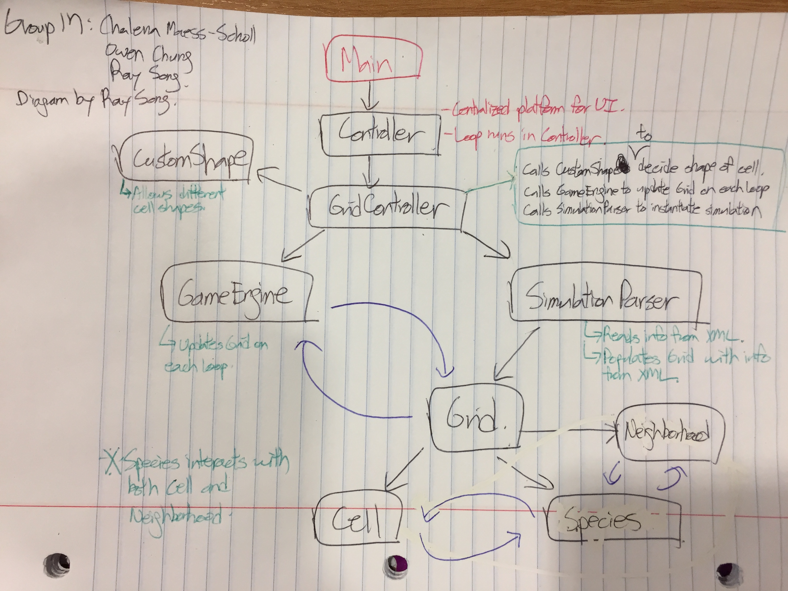

# Design for Cell Society

### Introduction

+ The objective of this project is to come up with a fluid, flexible platform on which various Cellular Automata programs - including, but not limited to Model of Segregation, Predator-Prey Relationships, Spreading of Fire, and Game of Life - can be run on.

+ Abstraction is the key to our project, in that the platform must be able to account for different types of CA simulations/models. Because of this we have come up with a solid base to our project and allowed the most flexibility to be in adding a simulation or changing the values/algorithms of a simulation. As such, we have come up with four key components to the project, which are as follows:
	* **Grid**: This is the basic template on which the *Game Engine* and each *Species* will operate.
	* **Game Engine** : This is part of the *Game Loop* of our project that will not only give the start/stop signs for each step of the game, but also store the *status quo* of each state so that individual species know whether to change their state or not once the Game Loop begins.
	* **Species** : This is the abstract model on which individual species will be based. Each individual species (ex: Sharks, Fire, different races) will work on the module provided by the Species superclass and manipulate the module so that specific details inherent to each model can be provided. The species class will be open to extension but closed to algorithms.
	* **Simulation Parser** : This is what will complete the parsing of the XML file needed to set up the chosen CA simulation. The values within these XML files can be changed as desired.

	

### Overview

+ **Main** 
	* Initializes **Controller.java**, which oversees all action and calls other classes as necessary.

+ **User Interface** 
	* See **User Interface** below
	* Refers to helper Controller classes (ex: **ButtonController.java**, **SceneController.java**) to call various functions of the program and visualize the simulation
	* Includes buttons that change the scene and start different Simulations

+ **Simulation Parser**
	* Completes the parsing of the XML file needed to set up the chosen CA simulation and returns the values within these files to classes that need them.
	* The SimulationParser class is extended for each simulation since each simulation might need to set more/different parameters than another.
	* Initializes the grid and returns it via a method called populateGrid() or repopulateGrid().

+ **Grid**
	* The **"world"** in which each individual cell operates, which is implemented with a 2d array. 
	* Includes methods to add a species to a random cell on the grid or to a specific cell on the grid, which are used by the SimulationParser when it populates the grid.
	* Also keeps track of which cells should be considered neighbors, as this can vary simulation to simulation, and which shape the grid cells should be displayed as.

+ **Game Engine**
	* Has access to the grid as it is in charge of updating it at each time step based on what the species algorithm would like to do, given its circumstances.
	* Creates a copy of the grid to refer to as it loops through each cell on the grid so that each species in each cell can choose a new location or state based on the initial configuration it was surrounded by.
	* Calls updateNextLocation on all species in each cell and either updates their state, updates their location on the grid, removes them from it if they died, or breeds another.

+ **Species**
	* Subclasses that represent different species for each simulation, as well as the algorithms that are in charge of how each cell responds given its current state & surroundings.
	* Interacts with neighbors based on its status at the given point in time
	* Different kinds of species will extend from the Species superclass and could have different characteristics. In other words, the structure will be open to extension. On the other hand, it will be closed to changes in algorithms. For example, different ways of defining satisfaction of a species should not lead to code changes in other classes. The other classes should follow the same open closed principle.
	 
+ **Cells**
    * A way of representing a cell, or position, on the grid. It keeps track of the current occupants in the cell and also knows where it itself is located on the grid (location).
    * Also has a getState function since each species could have a different state and an applyEffect function, which applies the effect of a species moving to that cell on the cell and its inhabitants.
    * Extended for some simulations that have additional parameters to control for each location on the grid.

+ **Neighborhood**
    * Finds and keeps track of a cell's surrounding neighbors and can be extended as each simulation might consider different locations to be 'neighbors'.
    * Also has a function to return a list of locations in which species are of a certain state.

+ **Shapes**
    * Constructs a shape that has a specific positioning on the grid based on the given values of row, column, length of a side, and margin for display purposes.
    * Has the capability to represent a variety of different shapes, with hexagon and square being the only ones implemented so far.

+ **Location**
    * Keeps track of x and y coordinate pairings.
    * Given a list of locations, it can also return locations that are adjacent to it.

+ **Orientation**
    * Knows which way a species is facing (N, NW, NE, E, S, SE, SW, W) and also returns what are considered 'forward locations' for ForagingAnts simulation.

#### Design Overview Diagram

	

### User Interface

+ When Main.java is executed, the Main Page will feature an empty grid (represented by non other than Professor Duvall's image) on the left-hand side, as well as five buttons on the right-hand side that each lead to different simulations: **Segregation, Fish-Shark, Spreading Fire, Game of Life, and Foraging Ants**.
	* The grid will always be in the same location, regardless of what page the user is on.
	* **Please refer to the picture at the end of this section for visual reference.**

+ Each simulation model page will contain the following features in common:
	* **Grid** (2D Array Representation): Display for current state of grid.
	* **Reset** (button): The grid will be initialized to its starting state.
	* **Start** (button): The game engine will run the game loop indefinitely, until the end conditions are reached or until the stop button is clicked.
	* **Stop** (button): The game engine will halt the game loop.
	* **Play** (button): The game engine will run a single iteration of the game loop.
	* **Size of Cell** (button): The button will trigger a **Text Field**, on which the user will input an integer that determines the size of each cell on the grid.
	* **Delay** (button): The button will trigger a **Scroll Bar**, which the user will use to select the delay between each iteration of the game loop.
	* **Run Another Simulation** (button): The user will be moved back to the **Main Page**, the initial page that contains the empty grid and the four buttons that each lead to different simulations.
	* **Species Distribution** (Line Chart): This is a dynamic line chart that represents the percentage of each species in the Grid that is shown to its left.
	
#### User Interface Diagram

### Design Details

+ **Main**
	+ Main is responsible for initializing the UI and initializing the grid. Once the user presses a UI simulation button, thus making a decision about which simulation to complete, Main will instantiate a simulation that reads in the corresponding XML file for that specific simulation (each simulation will have an XML file that describes the simulation and its global configuration parameters). Main will also call a function in the Grid class that populates the grid with a number of species based on the values of the simulation (given by the XML file).
	+ Once the start button is pressed for the simulation, a game loop will start in which main calls the game engine. The game loop controls how quickly the simulation advances through the state of the world. Each cycle of the game loop will use the game engine, which has the function of updating each species state based on the algorithm specified in each species subclass. 
	+ The game loop ends if the stop button is pressed, otherwise it runs indefinitely.
	+ To summarize, Main interacts with the user interface, the grid, and the game engine, in order to direct the flow of the simulation. However, it doesn't actually do any of the real simulation work (updating states of species) itself.

+ **User Interface** 
	+ The UI is responsible for visualizing the simulation and handling the user's interaction with the program. 
	+  By clicking the buttons on the UI (ex: Spreading Fire button, stop button, etc.), the user will be able to manipulate the simulation and/or the game loop.
	+ See above for more details.

+ **Grid Template**
	+ The grid template keeps track of each species location on the grid and has functions such as *getEmptyCells()* that will return a list of cells that are empty and can be moved to. This will allow each species to implement its own algorithm of movement/reaction without having to gain access to the entire grid.
	+ It is also responsible for initializing and positioning each species on the grid, so this class will interact with the species subclasses as well. This would be done by a function like *grid.populate(...)*, which would take in parameter values that specified which species to create and the amount needed, as well as a value like *probCatch* which could be needed by the species when it is running its algorithm/updating its state.
	+ The grid should also be able to resize itself based on a value, since the initial grid created might be of a different size then the one needed for a certain simulation.

+ **Game Engine**
	+ Responsible for checking whether each species is moving to a new location. It then updates the game settings e.g, species location, cell's parameters based on each species' next location parameters by calling *getNextLocation*. In short, It takes care of carrying out each step of the simulation.
	+ This class will also query each species to see if it needs to reproduce or if is dying and complete the actions necessary for those conditions.
	+ The game engine will be used by the Main class, which will pass the grid to it.
	+ The game engine will also interact with the grid, cell, species classes.

+ **Species**
	+ Species will be an abstract super class so that subclasses can be created that each know their own state and the rules that dictate how it responds to its environment, which is dependent on what other species it is closely surrounded by. 
	+ Each subclass will have a function *updateNextLocation(...)* that, given its surrounding neighbors as parameters, will update next location that it would like to move to. If the cell is an edge cell, the neighbor parameters that are over the edge boundary would not be passed in. 
	+ Each subclass will also have its own algorithm of movement or reaction to a certain state, so each subclass also needs to implement a updateNextLocation function that decides where to move on the grid. The move function will be passed available cells and neighborhood so that each species can make its decision about where to move based on its own specific algorithm but still without gaining access to the entire grid itself.
	+ Each subclass should also keep track of whether or not it needs to reproduce, as this is something that each species might want to do.
	+ Each species should also know its current location on the grid and also the cell it lives in.

+ **Cells**
	+  Cell is an abstraction that essentially provides a place for species to operate on. It could also carry out actions each time step if need be. For example,  Foraging ants requires the nest to breed ants each time step. AntCell, which is a subclass of Cell, implements this simulation specific actions with the *step* function.
	+ Cell also limits number of occupants it could store based on different simulation. 
	+ *applyEffect* function in cell takes in an argument that is the new species coming into the cell and updates the states of the species and also carries out required actions.

+ **Neighborhood**
	+  Neighborhood is an abstraction that stores the neighbors of a cell given its location. 
	+ One could utilize it to find the neighbors of a cell based on different definition on a subclasses of neighborhood.

+ **Shapes**

+ **Location**
	+  Location is an abstraction that represents the location on the grid. 
	+ One could utilize it to check whether two objects are at the same locaiton or get the adjacent cells of a specific location.

+ **Use Cases**
	1. Game engine class would call *updateNextLocation(...)* on the species subclass, which would update the next location of the species. If the next location is set to null, the species is removed because it indicates the species is dying.  On the other hand, if it's set to a different location than the current location,  applyEffect is called so that the cell could prepare for the incoming species and update the states for the incoming species.  Then, species is moved to the next location and breed if certain condition is met. 	
	2. Same as above.
	3. Call the game engine, which will loop through the grid and update each cell. The grid will then correspondingly be updated visually.
	4. Once the user decides to run the Fire simulation, Main will initialize the simulation class which will parse the Fire XML file and save those values in itself. 
	5. The user would press the UI button "run another simulation" which will take them back to the main splash screen from which they can choose a different simulation to run. Once they choose a simulation, the simulation class would be reset and use the values of the corresponding XML file. Main would then update everything and start running the new simulation.
	
### Design Considerations

+ Creating an extra simulation class to hold the values from the XML file.
	+ Pros:
		+ Reusability -> can simply re-initialize the simulation class to hold values from a different XML file which will be useful when a user wants to switch to a different simulation.
		+ Organization -> better to make it an extra class than add more code to Main that would parse/save those values.
	+ Cons:
		+ An extra class, another thing for Main to initialize and keep track of.
		
		
		
+ Letting Main have access to/interact with the majority of the classes to direct the flow of the simulation.
	+ Pros:
		+ Readability -> the main logic of the program is created and called from one place.
		+ Central hub that oversees the entire program.
	+ Cons:
		+ Main has access to the majority of the classes.
		+ Burdening Main with too many functionalities.
		+ Code could get cluttered.

+ Having a separate class for the UI
	+ Pros:
		+ Better manages complexity -> can easily make UI changes in one place.
		+ Less cluttered Main class.
	+ Cons:
		+ Main has to continuously interact with the UI class to check whether certain buttons have been pressed.

+ Letting the subclasses of species implement their own move algorithm instead of having those functions in the grid template or game engine.
	+ Pros:
		+ Easily extendable to create other simulations that use different species which have different rules.
		+ Logic is encapsulated, no other classes need to know anything about the species rules/algorithm.
	+ Cons:
		+ Species needs to receive the open cells in the grid as an input so that it can utilize its given algorithm to find the spot where it wants to go.
		+ Each species won't necessarily require a *move()* function, some might simply change their states.

+ Passing the species subclasses the cells that are empty instead of passing the entire grid to them.
	+ Pros:
		+ The subclasses don't receive all the information about their world, i.e. the grid they are in.
		+ Reduces the burden of having to pass the entire grid to each and every species instance.
	+ Cons:
		+ Have to find the applicable parameters before the method is called, instead of calling it and just letting the species figure it out by passing it the grid.
		
+ Assumptions/Dependencies
	+ The program assumes that each simulation button on the UI will also have an available XML file that is correctly formatted and can successfully be parsed by the simulation class.
	+ It also assumes that the species specified in the XML file do exist as subclasses of the superclass species.

### Team Responsibilities

+ One person in charge of Species/Simulation - Owen
+ One person in charge of Game Engine/Main - Chalena
+ One person in charge of Grid Template/UI - Ray

